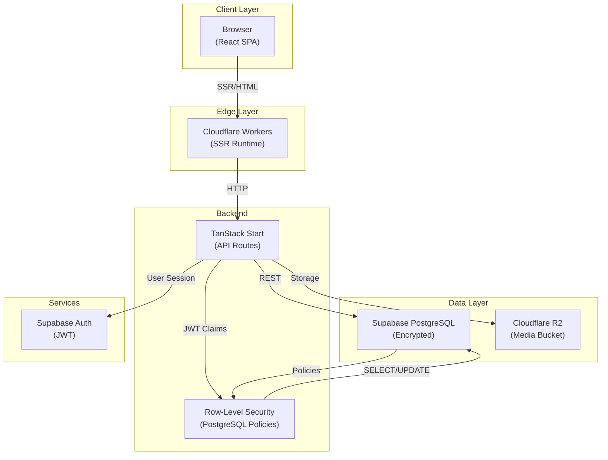

# New Al-Nasiriya Primary School

> **The official website and enterprise CMS for New Al-Nasiriya Primary School**
>
> مدرسة الناصرية الابتدائية الجديدة

<div align="center">

[](https://www.typescriptlang.org/)
[](https://react.dev/)
[](https://tanstack.com/start)
[](https://supabase.com/)
[](https://workers.cloudflare.com/)
[](#)

**Live**: https://newnasiriya.com

</div>

---

## Overview

Al-Nasiriya Digital Opus is a **production-ready, modern enterprise web platform** serving as the official digital presence of New Al-Nasiriya Primary School. Far more than a brochure website, it combines a **full-featured public website** with a **sophisticated role-based CMS** and comprehensive **content management infrastructure**.

The system is engineered for scale, maintainability, and professional operation. Every architectural decision—from database design to authentication—reflects enterprise standards and security best practices.

### Key Characteristics

- **Arabic-First Design**: Native RTL layout, bilingual content support (AR/EN), and localized user experience
- **Enterprise CMS**: Multi-module content management with role-based access control (RBAC)
- **Real-Time Publishing**: Draft-to-publish workflows with instant propagation
- **Media Management**: Integrated library with optimization, versioning, and usage tracking
- **Advanced Search**: Full-text search across 9 content categories with relevance scoring
- **Analytics**: Visitor tracking, page view metrics, and content performance analysis
- **Scalable Infrastructure**: Built on Supabase (PostgreSQL), deployed to Cloudflare Workers

---

## Table of Contents

1. [Features](#features)
2. [Architecture](#architecture)
3. [Tech Stack](#tech-stack)
4. [Project Structure](#project-structure)
5. [Routing Architecture](#routing-architecture)
6. [Database & CMS](#database--cms)
7. [Authentication & RBAC](#authentication--rbac)
8. [Content Modules](#content-modules)
9. [Media Library](#media-library)
10. [Search System](#search-system)
11. [Performance & SEO](#performance--seo)
12. [Deployment](#deployment)
13. [Development](#development)
14. [Contributing](#contributing)

---

## Features

### Public Website

- **Homepage**: Hero section, statistics, welcome message, news feed, and full-page preview sections
- **News System**: Articles with categories, featured content, and scheduled publishing
- **Academic Life**: Timetables, calendar events, guidelines, policies, attendance info, behavior rules
- **Honor Board**: Grade-level achievement lists with academic year filtering
- **Achievements**: School and student accomplishments with media galleries
- **Activities**: Event catalog with category organization and media galleries
- **Gallery**: Album-based image organization with public browsing
- **Search**: Unified search across all public content with relevance ranking
- **Contact**: Location maps, phone/email, working hours, social links

### Administration Panel

- **Dashboard**: Quick actions, module navigation, activity feeds
- **News Management**: Full CRUD with scheduling, featured flags, categories, and media
- **Academic Management**: Timetables, calendar events, guidelines, behavior rules
- **Honor Board Management**: Grade-level entry creation and organization
- **Achievement Management**: Article-style content with media attachment
- **Gallery Management**: Album and item management with drag-and-drop ordering
- **Media Library**: Centralized storage, tagging, categorization, usage tracking
- **Timeline System**: Academic year events with start/end dates and status
- **Contact Management**: View and filter submissions from the public contact form
- **Analytics**: Visitor metrics, popular pages, search analytics

### Enterprise Features

- **Role-Based Access Control (RBAC)**: Admin, Editor, Viewer roles with fine-grained permissions
- **Content Versioning**: Automatic snapshots of all published content changes
- **Audit Logging**: Complete activity trail for compliance and debugging
- **Bilingual Support**: Separate AR/EN fields throughout; theme auto-detection
- **Status Management**: Draft, Published, Archived states with timestamp tracking
- **Media Usage Tracking**: Know exactly where each image is used across the site

---

## Architecture



### Design Principles

1. **Security by Default**: All data protected by row-level security; authentication required at server entry
2. **Type Safety**: End-to-end TypeScript across client, server, and database
3. **Real-Time Publishing**: Content immediately available after status change; no rebuild needed
4. **Separation of Concerns**: UI logic, API logic, and data access cleanly isolated
5. **Audit Trail**: Every change logged with actor and timestamp for compliance

---

## Tech Stack

| Category | Technology | Version | Purpose |
|----------|-----------|---------|---------|
| **Runtime** | TanStack Start | 1.168.26 | Full-stack meta-framework |
| **Frontend** | React | 19.2 | UI library |
| **Routing** | TanStack Router | 1.170.16 | File-based routing |
| **State Management** | TanStack Query | 5.101.1 | Server state & caching |
| **Forms** | React Hook Form | 7.71.2 | Form state & validation |
| **Validation** | Zod | 3.24.2 | Schema validation |
| **Styling** | Tailwind CSS | 4.2.1 | Utility-first CSS |
| **Components** | Radix UI | Latest | Headless components |
| **Icons** | Lucide React | 0.575.0 | Icon library |
| **Charts** | Recharts | 2.15.4 | Analytics visualization |
| **Database** | PostgreSQL (Supabase) | 14+ | Primary data store |
| **Auth** | Supabase Auth | 2.110.0 | Authentication & JWT |
| **Storage** | Cloudflare R2 | - | Media hosting |
| **Deploy** | Cloudflare Workers | - | Serverless runtime |
| **Build** | Vite | 8.0.16 | Fast bundling |
| **Package Manager** | Bun | Latest | Fast runtime & package manager |

---

## Project Structure

```
naseria-digital-opus/
├── src/
│   ├── routes/                    # File-based routing (TanStack Router)
│   │   ├── __root.tsx             # Root layout with head config
│   │   ├── index.tsx              # Homepage
│   │   ├── auth.tsx               # Login page
│   │   ├── about.tsx              # School info & mission
│   │   ├── academic/              # Academic module
│   │   │   ├── index.tsx
│   │   │   ├── calendar.tsx
│   │   │   ├── attendance.tsx
│   │   │   ├── behaviour.tsx
│   │   │   ├── policies.tsx
│   │   │   ├── faq.tsx
│   │   │   ├── grades.$level.tsx
│   │   │   └── ...
│   │   ├── news/                  # News system
│   │   │   ├── index.tsx
│   │   │   └── $slug.tsx
│   │   ├── achievements/          # Achievements
│   │   │   ├── index.tsx
│   │   │   └── $slug.tsx
│   │   ├── honor/                 # Honor board
│   │   │   ├── index.tsx
│   │   │   └── grades.$level.tsx
│   │   ├── activities.tsx         # Activities list
│   │   ├── gallery/               # Gallery
│   │   │   ├── index.tsx
│   │   │   └── $slug.tsx
│   │   ├── contact.tsx            # Contact form
│   │   ├── search.tsx             # Search results
│   │   ├── admin/                 # Administration
│   │   │   ├── index.tsx
│   │   │   ├── news.tsx
│   │   │   ├── academic/
│   │   │   ├── gallery.tsx
│   │   │   ├── honor.tsx
│   │   │   ├── achievements.tsx
│   │   │   ├── analytics.tsx
│   │   │   ├── contact.tsx
│   │   │   ├── timeline.tsx
│   │   │   └── ...
│   │   ├── sitemap[.]xml.ts       # XML sitemap generation
│   │   └── routeTree.gen.ts       # Auto-generated (do not edit)
│   │
│   ├── components/                # Reusable UI components
│   │   ├── ui/                    # Primitive components (Radix + Tailwind)
│   │   ├── layout/                # Page layout (Header, Footer, Sidebar)
│   │   ├── home/                  # Homepage sections
│   │   ├── academic/              # Academic page components
│   │   ├── admin/                 # Admin panel components
│   │   ├── news/                  # News components
│   │   ├── gallery/               # Gallery components
│   │   ├── achievements/          # Achievement components
│   │   ├── honor/                 # Honor board components
│   │   ├── contact/               # Contact form
│   │   ├── search/                # Search UI
│   │   └── theme/                 # Theme toggle & providers
│   │
│   ├── lib/                       # Business logic & utilities
│   │   ├── academic.ts            # Academic module helpers
│   │   ├── achievements.ts        # Achievement logic
│   │   ├── admin-modules.ts       # Admin module definitions
│   │   ├── analytics.ts           # Analytics tracking
│   │   ├── analytics-query.ts     # Analytics data queries
│   │   ├── contact.ts             # Contact form helpers
│   │   ├── gallery.ts             # Gallery logic
│   │   ├── honor.ts               # Honor board logic
│   │   ├── media.ts               # Media utilities
│   │   ├── news.ts                # News logic
│   │   ├── search.ts              # Search engine
│   │   ├── timeline.ts            # Timeline logic
│   │   ├── theme.tsx              # Theme management
│   │   ├── auth/                  # Authentication helpers
│   │   ├── error-capture.ts       # SSR error handling
│   │   └── utils.ts               # General utilities
│   │
│   ├── integrations/
│   │   └── supabase/
│   │       ├── client.ts          # Supabase client
│   │       └── auth-attacher.ts   # Auth middleware
│   │
│   ├── assets/                    # Static assets
│   │   └── brand/                 # School logo, images
│   │
│   ├── cms/                       # CMS-specific logic
│   │
│   ├── hooks/                     # Custom React hooks
│   │
│   ├── styles.css                 # Global Tailwind styles
│   ├── router.tsx                 # Router factory
│   ├── start.ts                   # Start middleware setup
│   └── server.ts                  # SSR error wrapper
│
├── supabase/
│   ├── migrations/                # Database migrations
│   │   ├── 20260701182124_*.sql   # Schema: auth, profiles, roles
│   │   ├── 20260701201217_*.sql   # Schema: news, achievements
│   │   ├── 20260701202638_*.sql   # Schema: gallery, activities
│   │   ├── 20260701203833_*.sql   # Schema: honor board
│   │   ├── 20260701230733_*.sql   # Schema: search, versioning
│   │   └── 20260702014754_*.sql   # Schema: analytics, contact
│   └── config.toml                # Supabase config
│
├── public/                        # Public static assets
│
├── package.json                   # Dependencies & scripts
├── tsconfig.json                  # TypeScript config
├── vite.config.ts                 # Vite config
├── eslint.config.js               # Linting rules
├── .env                           # Environment variables
├── .prettierrc                    # Code formatting
├── SECURITY.md                    # Security policy
├── AGENTS.md                      # Lovable.dev instructions
└── README.md                      # This file
```

---

## Routing Architecture

The project uses **TanStack Router's file-based routing system**. Every `.tsx` file in `src/routes/` automatically becomes a route.

### Route Conventions

| File | URL | Type |
|------|-----|------|
| `index.tsx` | `/` | Root route |
| `about.tsx` | `/about` | Standalone page |
| `news/index.tsx` | `/news` | Module index |
| `news/$slug.tsx` | `/news/:slug` | Dynamic segment |
| `academic.grades.$level.tsx` | `/academic/grades/:level` | Nested route |
| `__root.tsx` | `<html>` | App shell (required) |
| `sitemap[.]xml.ts` | `/sitemap.xml` | Server route |

### Head Management

Each route defines its own `<head>` metadata:

```typescript
export const Route = createFileRoute("/news/$slug")({
  head: () => ({
    meta: [
      { title: newsItem.title },
      { name: "description", content: newsItem.summary },
      { property: "og:image", content: newsItem.image },
    ],
    links: [
      { rel: "canonical", href: `/news/${newsItem.slug}` },
    ],
  }),
  component: NewsPage,
});
```

---

## Database & CMS

### PostgreSQL Schema

The database is organized into **14 major domains**:

```
1. Authentication & Profiles
2. Media Library
3. Site Settings & Info
4. Homepage Hero
5. Statistics
6. Academic (years, grades, timetables, calendar)
7. Activities
8. Honor Board
9. Achievements
10. News
11. Gallery
12. Instructions (student/parent guidelines)
13. Contact & Social
14. Admin (audit log, versioning, outbox)
```

### Core Entities

#### `user_roles` — Role-Based Access Control
```sql
CREATE TABLE public.user_roles (
  id uuid PRIMARY KEY,
  user_id uuid NOT NULL REFERENCES auth.users(id),
  role public.app_role NOT NULL,  -- 'admin' | 'editor' | 'viewer'
  created_at timestamptz
);
```

#### `media` — Unified Media Library
```sql
CREATE TABLE public.media (
  id uuid PRIMARY KEY,
  bucket text NOT NULL DEFAULT 'media',
  storage_path text NOT NULL,
  file_name text NOT NULL,
  mime_type text NOT NULL,
  width int, height int, size_bytes bigint,
  alt_ar text, alt_en text,
  caption_ar text, caption_en text,
  category_id uuid REFERENCES public.media_categories,
  tags text[],
  is_archived boolean,
  created_by uuid, created_at timestamptz
);
```

#### `news` — Article System
```sql
CREATE TABLE public.news (
  id uuid PRIMARY KEY,
  title_ar text, title_en text,
  slug text UNIQUE,
  summary_ar text, summary_en text,
  body_ar text, body_en text,
  featured_image_media_id uuid,
  is_featured boolean,
  status public.content_status,  -- 'draft' | 'published' | 'archived'
  published_at timestamptz,
  scheduled_at timestamptz,
  view_count int,
  search_tsv tsvector GENERATED,  -- Full-text search
  created_by uuid, updated_by uuid,
  created_at timestamptz, updated_at timestamptz
);
```

Similar structures exist for **achievements**, **activities**, **gallery**, **honor_entries**, etc.

### Row-Level Security (RLS)

All tables have **Row-Level Security enabled**. Access is controlled by database policies:

```sql
-- Public read-only for published content
CREATE POLICY "news: public read published" 
  ON public.news FOR SELECT 
  USING (status = 'published' OR public.is_staff(auth.uid()));

-- Staff can write
CREATE POLICY "news: staff write" 
  ON public.news FOR ALL TO authenticated 
  USING (public.is_staff(auth.uid())) 
  WITH CHECK (public.is_staff(auth.uid()));
```

Benefits:
- **Security enforced at database layer**, not application layer
- **Multi-tenancy-ready** (future school expansion)
- **Audit trail included** (JWT claims always available)
- **Zero trust** — no privilege escalation possible

### Content Versioning

Every published content change is automatically snapshotted:

```sql
CREATE TABLE public.content_versions (
  id uuid PRIMARY KEY,
  entity_table text,
  entity_id uuid,
  version int,
  snapshot jsonb,  -- Full document state
  created_by uuid,
  created_at timestamptz
);
```

This enables:
- **Version history** (restore old content)
- **Change audits** (who edited what)
- **Rollback capability** (one-click restore)

---

## Authentication & RBAC

### Auth Flow

1. User submits email + password on `/auth`
2. TanStack Start handler calls `signInWithPassword()`
3. Supabase Auth validates credentials, returns JWT
4. JWT stored in secure HTTP-only cookie
5. Subsequent requests include JWT in Authorization header
6. Middleware attaches `user` to request context
7. RLS policies evaluate `auth.uid()` claim

### Role Hierarchy

| Role | Permissions |
|------|-------------|
| **admin** | Full CRUD on all content; manage users & roles; view analytics |
| **editor** | Create, edit, publish content; upload media; view own analytics |
| **viewer** | Read-only access; view published content only |

Enforced via database functions:

```typescript
export async function has_role(userId: UUID, role: app_role): Promise<boolean> {
  // Runs in PostgreSQL with SECURITY DEFINER
}
```

### Session Management

- **Persistent Sessions**: "Remember me" stores JWT in localStorage
- **Token Refresh**: Automatic on expiration (24h)
- **Secure Logout**: Clears session and revokes token
- **Audit Logging**: All auth attempts logged to `audit_log`

---

## Content Modules

### News System

**Route**: `/admin/news` | `/news` (public)

- **List View**: Paginated grid with search, filter by category/status
- **Create**: Rich editor for AR/EN content, featured image, scheduling
- **Publish**: Draft → Published with timestamp
- **Archive**: Soft delete (content hidden but preserves history)
- **Scheduling**: Publish at future date/time
- **SEO**: Custom title, description, OG image per article

**Database**: `news`, `news_categories`, `news_media`

---

### Academic Module

**Route**: `/admin/academic` | `/academic` (public)

**Sections**:
- **Timetables**: Academic & exam schedules per grade
- **Calendar**: Academic year events (holidays, exams, parent meetings)
- **Attendance Info**: General guidelines for parents
- **Behavior Guidelines**: Discipline policies with icons
- **Policies**: School-wide rules and procedures
- **FAQ**: Frequently asked questions (if available)

**Database**: `academic_years`, `grades`, `timetables`, `academic_calendar_events`, `behaviour_guidelines`

---

### Honor Board

**Route**: `/admin/honor` | `/honor` (public)

- **Grade-Level Lists**: Separate honor rolls per grade
- **Academic Years**: Filter by year
- **Student Entries**: Name, achievement date, category
- **Media Attachments**: Certificates or achievement photos

**Database**: `honor_categories`, `honor_entries`, `honor_entry_media`

---

### Achievements

**Route**: `/admin/achievements` | `/achievements` (public)

- **Article-Style Content**: Title, description, date, category
- **Featured Flag**: Pin to homepage
- **Media Gallery**: Multiple images per achievement
- **SEO Fields**: Custom OG image and metadata

**Database**: `achievement_categories`, `achievements`, `achievement_media`

---

### Activities

**Route**: `/admin/activities` (integrated in academic) | `/activities` (public)

- **Event Listing**: Upcoming and past activities
- **Categorization**: Sports, cultural, academic, etc.
- **Media Gallery**: Event photos
- **Event Date**: When activity occurred

**Database**: `activity_categories`, `activities`, `activity_media`

---

### Gallery

**Route**: `/admin/gallery` | `/gallery` (public)

- **Album Management**: Create, reorder, delete albums
- **Item Ordering**: Drag-and-drop within album
- **Captions**: AR/EN text per image
- **Cover Images**: Album preview selection

**Database**: `gallery_albums`, `gallery_items`

---

### Timeline System

**Route**: `/admin/timeline` (in academic/dashboard)

- **Academic Year Events**: Year start, term markers, milestones
- **Visual Timeline**: Chronological display on homepage
- **Status Management**: Draft/published states

**Database**: `academic_timeline_events`

---

### Contact System

**Route**: `/admin/contact` | `/contact` (public form)

**Features**:
- **Form Submission**: Name, email, message, subject
- **Admin Review**: List view with search and filtering
- **Status Tracking**: Unread → Read → Resolved
- **Export**: (Future feature)

**Database**: `contact_submissions`

---

## Media Library

### Architecture

- **Database**: `media` table tracks all assets
- **Storage**: Cloudflare R2 (S3-compatible)
- **CDN**: Cloudflare automatic
- **Versioning**: Multiple versions per asset stored separately
- **Optimization**: Images automatically resized and optimized

### Features

1. **Unified Access**: All media searchable and tagable
2. **Usage Tracking**: Know where each image is used via `media_usages` table
3. **Categorization**: Organize by media type
4. **Tagging**: Add searchable tags
5. **Archive**: Soft-delete without losing history
6. **Alt Text**: Bilingual alt text for accessibility

### Upload Flow

1. User selects file in admin
2. File uploaded to R2 via presigned URL
3. Metadata stored in `media` table
4. Image automatically resized (thumbnails, web-sizes)
5. CDN URL generated
6. Returned to form for attachment

---

## Search System

### Unified Search Engine

**Route**: `/search?q=...` | Query via API

The search system runs **parallel queries** across 9 content categories:

1. **Static Pages**: Navigation (home, about, academic, contact, etc.)
2. **News**: Articles with full-text search
3. **Achievements**: Accomplishments with descriptions
4. **Activities**: Event listing
5. **Gallery Albums**: Photo collections
6. **Honor Board**: Grade-level achievements
7. **Academic**: Calendar events, timeline, FAQ
8. **Media Library**: Image search by alt text & filename
9. **FAQ**: Q&A pairs (if available)

### Scoring Algorithm

Relevance scoring considers:
- **Field weight**: Title (100x) > Summary (20x) > Body (10x)
- **Match type**: Exact (100x) > Prefix (40x) > Contains (20x)
- **Content flags**: Featured (+15), Pinned (+30)
- **Recency**: Recently updated content ranked higher

### Implementation

```typescript
export async function runSearch(
  term: string,
  filters: SearchFilters = {},
): Promise<SearchHit[]>
```

Returns paginated, sorted `SearchHit[]` with breadcrumbs and internal links.

### Recent Searches

Client-side localStorage caches recent searches. No user tracking on server.

---

## Performance & SEO

### Performance Optimizations

#### Image Strategy
- **Lazy Loading**: `loading="lazy"` on below-fold images
- **Responsive Images**: `srcset` and `sizes` attributes
- **Format Conversion**: WebP with JPEG fallback
- **CDN Caching**: Cloudflare R2 + Workers cache
- **Compression**: Automatic at R2 layer

#### Code Splitting
- **Route-Based**: Each route is a separate JS chunk
- **Component Lazy Loading**: Admin panels loaded on-demand
- **Tree Shaking**: Unused Radix UI components removed

#### Caching Strategy
- **Static Assets**: Cached by Cloudflare Workers (1 year)
- **HTML**: Stale-while-revalidate (10s)
- **API Responses**: Cached by TanStack Query (5m default)
- **Database**: Query-level caching via RLS

### SEO Implementation

#### Metadata
- **Dynamic Titles**: Unique per page
- **Meta Descriptions**: Crafted for each route
- **OG Images**: Custom per news article, achievement
- **Canonical URLs**: Prevent duplicate content
- **Language Tags**: `hreflang` for AR/EN variants (future)

#### Structured Data
- **JSON-LD**: EducationalOrganization schema in root
- **Microdata**: breadcrumb trails on content pages

#### Sitemap
- **Dynamic Generation**: `/sitemap.xml` generated at request time
- **Coverage**: All published news, achievements, galleries, etc.
- **Update Frequency**: news (weekly), static pages (monthly)

#### Robots.txt
```
User-agent: *
Disallow: /admin
Disallow: /auth
Allow: /
```

---

## Deployment

### Environment

Built and deployed to **Cloudflare Workers** with **PostgreSQL (Supabase)** as the database.

### Build Process

```bash
bun run build
```

Produces:
- `dist/client/` — Browser-runnable SPA with route chunks
- `dist/server/` — Cloudflare Worker handler

### Production Configuration

**Environment Variables** (`.env`):
```
SUPABASE_PROJECT_ID=<project-id>
SUPABASE_PUBLISHABLE_KEY=<anon-key>
SUPABASE_URL=<api-url>
VITE_SUPABASE_PROJECT_ID=<project-id>
VITE_SUPABASE_PUBLISHABLE_KEY=<anon-key>
VITE_SUPABASE_URL=<api-url>
```

### Cloudflare Workers Deployment

1. Worker invokes `src/server.ts` (default)
2. Server initializes TanStack Start entry
3. Router matches incoming request to route
4. Route handler queries Supabase (RLS enforced)
5. HTML/JSON streamed back to client
6. Client hydrates React and takes over

### Database Migrations

Migrations live in `supabase/migrations/` and are versioned by timestamp:

```bash
supabase migration new create_news_table
# ... Edit migration file ...
supabase db push  # Apply to production
```

---

## Development

### Prerequisites

- **Node.js** 18+
- **Bun** (package manager & runtime)
- **Supabase CLI** (for local DB)

### Setup

```bash
# Clone repository
git clone https://github.com/NewNasiriya/naseria-digital-opus.git
cd naseria-digital-opus

# Install dependencies
bun install

# Start local database (optional)
supabase start

# Configure environment
cp .env.example .env
# Edit .env with your Supabase credentials
```

### Commands

| Command | Purpose |
|---------|---------|
| `bun run dev` | Start dev server (http://localhost:5173) |
| `bun run build` | Production build |
| `bun run build:dev` | Dev build with debugging |
| `bun run preview` | Preview production build locally |
| `bun run lint` | ESLint + Prettier check |
| `bun run format` | Auto-format code |

### Development Workflow

1. **Edit Route**: Create new `.tsx` in `src/routes/`
2. **Write Component**: Component auto-discovered
3. **Hot Reload**: Browser updates automatically
4. **Type Check**: TypeScript validates in real-time
5. **Test Locally**: http://localhost:5173
6. **Push**: Git commits sync to GitHub and Lovable

### Code Standards

- **TypeScript**: Strict mode enabled (`"strict": true`)
- **Linting**: ESLint with React hooks rules
- **Formatting**: Prettier with 90-char line width
- **Naming**: camelCase for functions/vars, PascalCase for components
- **Comments**: JSDoc for public APIs

---

## Contributing

### Development Philosophy

This project is connected to **Lovable.dev** for collaborative development. Avoid force-pushing or rebasing commits after they've been published—this breaks history sync.

### Workflow

1. Create a feature branch from `main`
2. Make your changes
3. Test locally (`bun run dev`)
4. Commit with clear messages
5. Open a Pull Request with description
6. Code review & approval
7. Merge to `main`

### Commit Message Convention

```
<type>: <description>

<optional body>

Closes #<issue-number>
```

Types: `feat`, `fix`, `docs`, `style`, `refactor`, `test`, `chore`

### Pull Request Template

```markdown
## Description
Brief explanation of changes.

## Related Issues
Closes #123

## Testing
- [ ] Tested locally
- [ ] No console errors
- [ ] Responsive design verified

## Screenshots (if UI changes)
Attach images or videos.
```

---

## Project Philosophy

### Principles

1. **Enterprise Standards**: Architected for production from day one
2. **Type Safety**: TypeScript throughout; zero `any` types
3. **Security First**: RLS + JWT + HTTPS only
4. **Accessibility**: WCAG 2.1 AA compliant
5. **Maintainability**: Clear structure, well-documented
6. **Arabic Excellence**: Native RTL support, not an afterthought

### Non-Goals

- Single Page Application (SPA) — Server-rendered HTML for SEO
- Headless CMS — Tightly integrated, not API-first
- Marketing Hype — Boring, reliable, professional

---

## Future Roadmap

### Planned Features (Not Yet Implemented)

- [ ] **Student Portal**: Grades, attendance, timetable viewer (auth-required)
- [ ] **Parent Portal**: Child performance tracking, communication inbox
- [ ] **Announcement System**: Mass SMS/email notifications
- [ ] **Document Management**: PDF/Word upload and sharing
- [ ] **Event Registration**: Booking system for parent meetings
- [ ] **Multilingual Expansion**: Support for additional languages
- [ ] **Mobile App**: Native iOS/Android (PWA first)
- [ ] **AI Features**: Content auto-translation, smart categorization
- [ ] **Analytics Dashboard**: Advanced KPIs and reporting
- [ ] **Backup & Disaster Recovery**: Automated daily snapshots

---

## Security

### Implemented Measures

- **Encryption in Transit**: TLS 1.3 only (Cloudflare)
- **Encryption at Rest**: PostgreSQL encrypted backups
- **Row-Level Security**: Database-enforced access control
- **JWT Authentication**: Secure, stateless sessions
- **CSRF Protection**: SameSite cookies, origin validation
- **XSS Prevention**: React auto-escapes by default, no innerHTML
- **SQL Injection**: Parameterized queries only (Supabase client)
- **Rate Limiting**: Cloudflare DDoS protection
- **Audit Logging**: All admin actions logged with timestamps

### Reporting Vulnerabilities

See [SECURITY.md](./SECURITY.md) for responsible disclosure process.

---

## License

This project is **private** and maintained for New Al-Nasiriya Primary School. Unauthorized copying or use is prohibited.

---

## Credits

### Built With

- **[TanStack](https://tanstack.com/)** — Modern full-stack frameworks
- **[Supabase](https://supabase.com/)** — Open-source Firebase alternative
- **[Cloudflare](https://cloudflare.com/)** — Global edge network
- **[Tailwind CSS](https://tailwindcss.com/)** — Utility-first styling
- **[Radix UI](https://radix-ui.com/)** — Headless component library

### Design Inspiration

Enterprise education platforms, professional SaaS dashboards, and Arabic-language best practices.

---

## Contact

For questions, issues, or feature requests, please contact the development team or visit **https://newnasiriya.com/contact**.

---

<div align="center">

**Made with ❤️ for New Al-Nasiriya Primary School**

</div>
